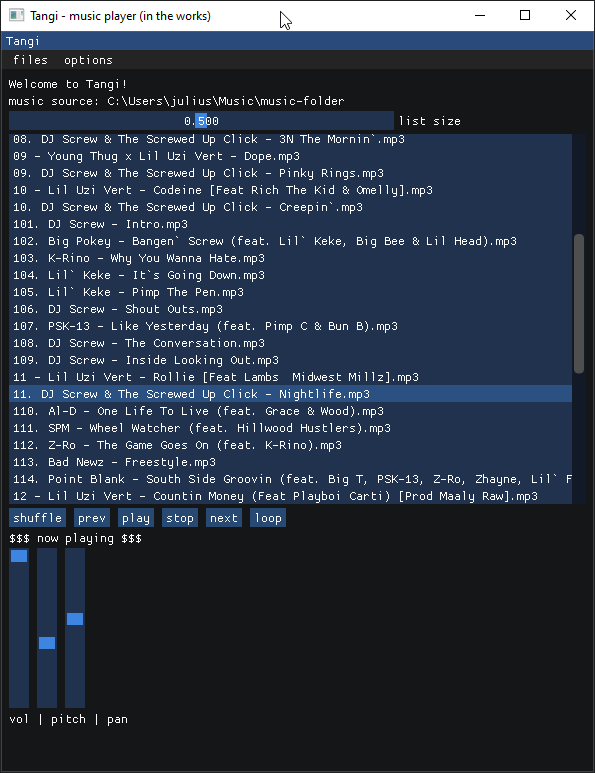

# tangi

## music player written in c++ similar to foobar2000

 

  

Currently this is just a simple framework built in ImGui but here are some plans for future features.

**List of features I'm planning on implementing:**
- music visualizer similar to milkdrop(as close as I can get)
- bass visualizer with colors relative to bass
- vol slider and song scrolling
- pause + play song
- song preview with icons and metadata
- folder/playlist previewer and song selection

**features I might do:**
- mixer features like fl studio but basic
- download or stream songs from Youtube or other platforms
